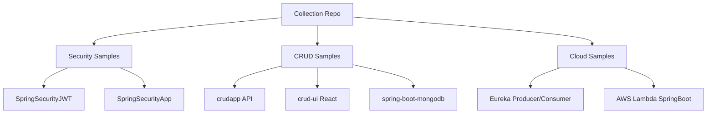

# SpringBoot Collections

A collection of Spring Boot and related full-stack sample projects covering security, CRUD APIs, MongoDB, Eureka service discovery, AWS Lambda deployment, and React UI integration.

## Overview

This repository groups multiple independent examples:

- **SpringSecurityJWT** – JWT auth sample
- **SpringSecurityApp** – role-based authorization sample
- **crudapp** – Spring Boot CRUD backend
- **crud-ui** – React frontend for CRUD flows
- **spring-boot-mongodb** – MongoDB query examples
- **EurekhaHelloWorld** – Eureka producer/consumer sample
- **aws-lambda-springboot-api-main** – Spring Boot packaged for AWS Lambda/API Gateway

## Architecture / Stack

- Java + Spring Boot (multiple modules)
- Spring Security (JWT + role-based auth)
- MongoDB (for selected demos)
- React (for `crud-ui`)
- Maven / Maven Wrapper



## Quickstart

### Prerequisites

- Java 17+ (some modules may work on older versions, but 17+ is recommended)
- Maven 3.8+
- Node.js 18+ (for `crud-ui`)
- MongoDB (for modules that require it)

## Environment Variables

No single `.env` governs the whole monorepo.

Common runtime configuration is handled with `application.properties`/`application.yml` inside each module.
For cloud modules, supply credentials via your deployment environment (not committed files).

## Run

Run modules independently from their own directories.

### Example: SpringSecurityJWT

```bash
cd SpringSecurityJWT
./mvnw spring-boot:run
```

### Example: crudapp backend

```bash
cd crudapp
mvn spring-boot:run
```

### Example: crud-ui frontend

```bash
cd crud-ui
npm install
npm start
```

## Test

Per module:

```bash
# Maven-based modules
mvn test

# Wrapper-based modules
./mvnw test
```

`crud-ui` supports React scripts test command where applicable:

```bash
cd crud-ui
npm test
```

## Deployment

- **AWS Lambda module:** see `aws-lambda-springboot-api-main/README.md`
- **Other modules:** package JAR and deploy as standard Spring Boot apps

```bash
mvn clean package
java -jar target/*.jar
```

## API Snippets (Representative)

From `crudapp`:

- `GET /users`
- `GET /users/{name}`
- `POST /load`
- `GET /delete/{name}`

Request (`POST /load`):

```json
{
  "name": "Jane",
  "email": "jane@example.com"
}
```

From `SpringSecurityJWT`:

- `GET /api/v1/awt`
- `POST /api/v1/awt/auth`

Request (`POST /api/v1/awt/auth`):

```json
{
  "username": "user",
  "password": "password"
}
```

Response: JWT token string.

## Troubleshooting

- **Port conflicts**: multiple apps default to 8080; change `server.port` per module.
- **Mongo connection issues**: verify local MongoDB is running and connection URI is correct.
- **Maven wrapper permission denied**: run `chmod +x mvnw`.
- **Dependency mismatches**: run `mvn -U clean install`.

## Changelog

See [CHANGELOG.md](CHANGELOG.md).

## License

No `LICENSE` file is currently present in this repository.
To avoid assuming legal intent, this docs update does not add one.
